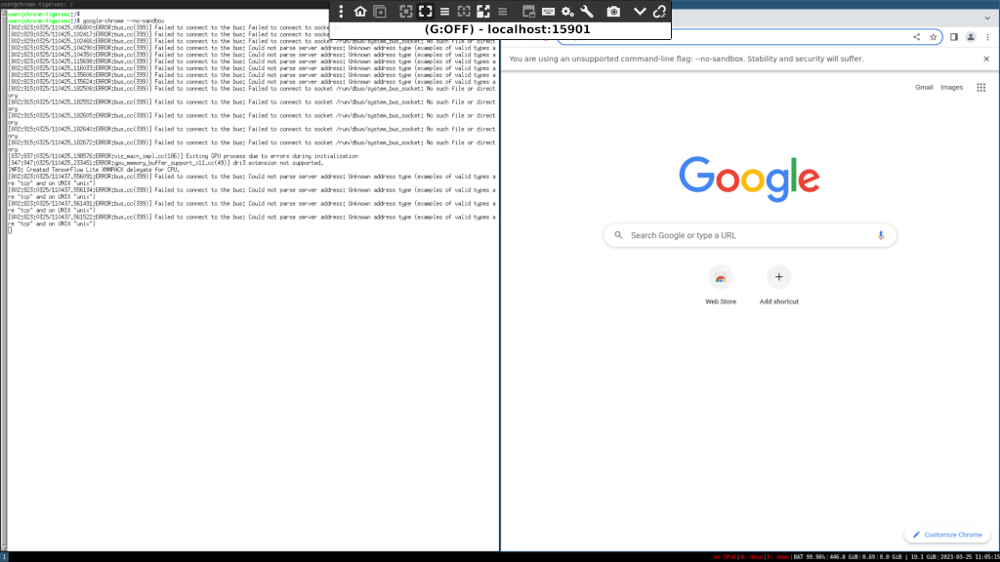

# Base docker container with i3, Chrome and TigerVNC

Base docker container with i3, Chrome and TigerVNC.



## Building

```
docker build -t docker-chrome-tigervnc .
```

## Deployment

```
docker-compose up -d
```

## Usage

Use VNC client (e.g. Remmina) to connect to `localhost:15901`. An empty virtual desktop should appear. Choose Alt as an i3 key and save configuration. Use Alt+Enter to open terminal. Type `google-chrome --no-sandbox` to open Google Chrome.

